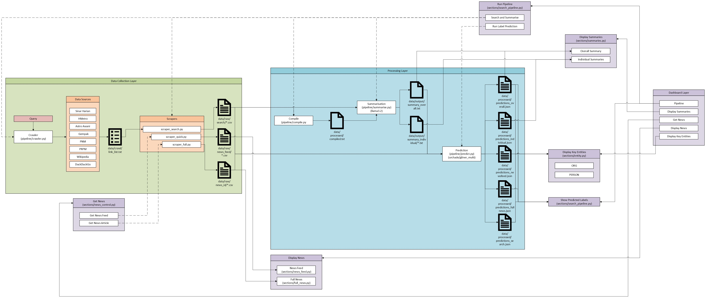
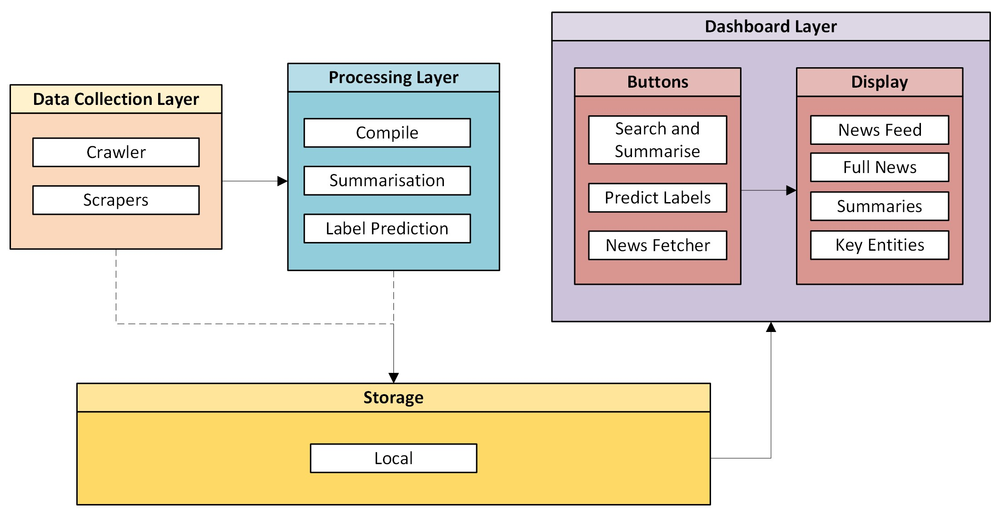
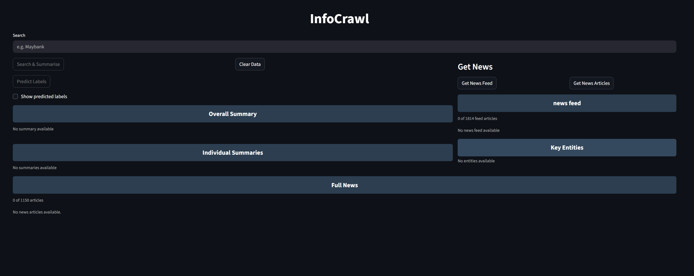
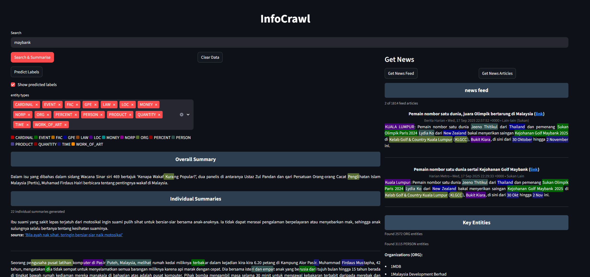
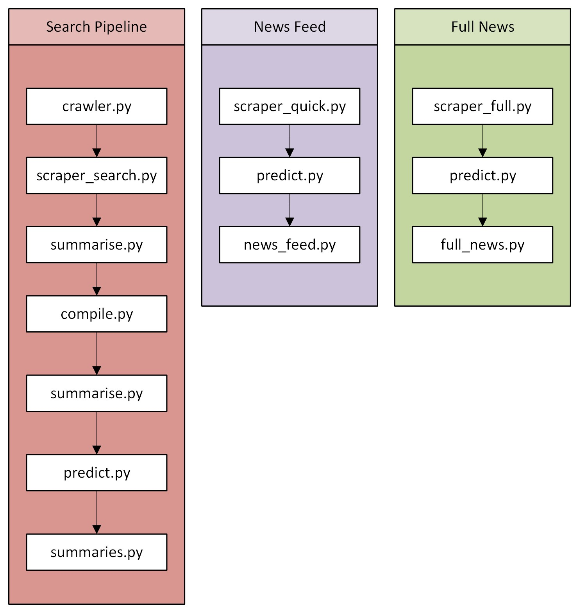

# InfoCrawl: 

<details>
<summary>Table of Contents</summary>
  
- [1. Introduction](#1-introduction)
- [2. System Architecture](#2-system-architecture)
  - [2.1 Data Collection Layer](#21-data-collection-layer)
  - [2.2 Processing Layer](#22-processing-layer)
  - [2.3 Storage](#23-storage)
  - [2.4 Dashboard Layer](#24-dashboard-layer)
- [3. Code Workflow](#3-code-workflow)
- [4. Data Overview](#4-outputs)
- [5. Installation](#5-installation)
- [6. Usage](#6-usage)
- [7. Limitations](#7-limitations)
- [8. Conclusion](#8-conclusion)
- [9. References](#9-references)
  
</details>

## 1. Introduction
InfoCrawl is an information fetcher that fetches and summarises information based on the user query. The fetching focuses on Malaysian context and most of the data is obtained from Malaysian news sites. Additionally, based on the information gathered, the labels on various entities are predicted and displayed.

This system uses Selenium and BeautifulSoup for data collection, Ollama to summarise the text data, and GliNER (urchade/gliner_multi) for label prediction.

---
## 2. System Architecture
This is the overall architecture for InfoCrawl (excluding the root files i.e. main.py, utils.py, and ui_helpers.py)


But to simplify;


The architecture of InfoCrawl can be divided into three main layers:
- Data Collection Layer
- Processing Layer
- Storage
- Dashboard Layer

### 2.1 Data Collection Layer
- **Crawler (`pipeline/crawler.py`)**  
  Builds search URLs from multiple sources:

  A. Crawling Articles:
  - Sinar Harian
  - HMetro
  - Astro Awani
  - Gempak

  B. Crawling Links:
  - DuckDuckGo  (from search results)

  C. Direct:
  - Wikipedia
  - PRPM  (dictionary)
  - PNM (library)

  Saves discovered article links into `data/crawl/link_list.txt`.

- **Scrapers**
  Once the specific list of list is obtained. These scrapers can extract the data from those sites. The data that we are looking for is any textual data from the respective articles.

  There are two types of scrapers for different purposes:

  A. Query-based data, to get data from the links obtained from the crawling:
  - `pipeline/scraper_search.py` :  Scrapes article pages from the link list and saves them into `data/raw/search/*.csv`.

  B. General news, to get news articles that may or mayu not be related to the query. This is for data storage for future use:
  - `pipeline/scraper_quick.py` : Fetches RSS feeds from Utusan, BHarian, HMetro, Kosmo, Astro Awani and saves them into `data/raw/news_feed/*.csv`. 
  - `pipeline/scraper_full.py` : Randomly samples article IDs from Utusan Malaysia, scrapes full articles, and saves them into `data/raw/news_id/*.csv`. 

  Generally, the `pipeline/scraper_search.py` is run for each query. Meanwhile,`pipeline/scraper_quick.py` and `pipeline/scraper_full.py` are run, preferably, regularly.

  <details>
  <summary>CSV files format reference</summary>
    
  #### Search CSV (`data/raw/search/*.csv`)
  | Column        | Description                                      |
  |---------------|--------------------------------------------------|
  | `Title`       | Article headline                                 |
  | `Source_URL`  | Direct link to the article                       |
  | `Publish_Date`| Date the article was published (if available)    |
  | `Category`    | Category/section of the article (if available)   |
  | `Content`     | Full scraped article text                        |

  #### News Feed CSV (`data/raw/news_feed/*.csv`)
  | Column        | Description                                      |
  |---------------|--------------------------------------------------|
  | `News_Source` | Source name                                      |
  | `Title`       | Article headline                                 |
  | `Source_URL`  | Direct link to the article                       |
  | `Publish_Date`| Date from RSS feed                               |
  | `Category`    | Category/section (if available)                  |
  | `Summary`     | Short summary/description from RSS feed          |
  | `Scrape_Date` | Date/time the feed was scraped                   |

  #### Full News CSV (`data/raw/news_id/*.csv`)
  | Column        | Description                                      |
  |---------------|--------------------------------------------------|
  | `News_Source` | Source name                                      |
  | `Title`       | Article headline                                 |
  | `Source_URL`  | Direct link to the article                       |
  | `Publish_Date`| Date the article was published                   |
  | `Category`    | Category/section of the article                  |
  | `Summary`     | Extracted summary/lead text                      |
  | `Scrape_Date` | Date/time the article was scraped                |

  </details>

### 2.2 Processing Layer
- **Compile (`pipeline/compile.py`)**  
  Reads all search CSVs, extracts article content, and combines them into a single text file (`data/processed/compiled.txt`).

- **Summarisation (`pipeline/summarise.py`)**  
  Uses [Ollama](https://ollama.ai/) with the `llama3.2` model to generate:  
  - Individual summaries (`data/output/summary_individual/*.txt`)  
  - An overall summary (`data/output/summary_overall.txt`)

- **Label Prediction (`pipeline/predict.py`)**  
  Uses [GLiNER](https://huggingface.co/urchade/gliner_multi) for entity recognition.
  Generates JSON outputs with entities for:
  - Individual summaries (`data/processed/predictions_individual.json`)
  - Overall summary (`data/processed/predictions_overall.json`)
  - News feed (`data/processed/predictions_newsfeed.json`)
  - Full news (`data/processed/predictions_fullnews.json`)
  - User query (`data/processed/predictions_search.json`)

  <details>
  <summary>Entity types</summary>

  | Label         | Description                                  |
  |---------------|----------------------------------------------|
  | `PERSON`      | People, including fictional                  |
  | `ORG`         | Organizations, companies, institutions       |
  | `GPE`         | Countries, cities, states                    |
  | `LOC`         | Non-GPE locations (mountains, rivers)        |
  | `FAC`         | Facilities (buildings, airports, highways)   | 
  | `NORP`        | Nationalities, religious or political groups |
  | `PRODUCT`     | Products, objects, devices                   |
  | `EVENT`       | Named events (wars, sports events)           |
  | `WORK_OF_ART` | Titles of books, songs, artworks             |
  | `LAW`         | Named laws, treaties, regulations            |
  | `MONEY`       | Monetary values                              |
  | `PERCENT`     | Percentage values                            |
  | `TIME`        | Times smaller than a day                     |
  | `DATE`        | Absolute or relative dates                   |
  | `ORDINAL`     | “first”, “second”, etc.                      |
  | `CARDINAL`    | Numerals not covered by other types          |
  | `QUANTITY`    | Measurements (weight, distance, etc.)        |

  </details>

  <details>
<summary>JSON file format reference</summary>
  
`data/processed/predictions_*.json` :
```
{ "<doc_key>":   [ 
    { 
      "start": int, 
      "end": int, 
      "text": str, 
      "label": str, 
      "score": float 
    } 
  ] 
}
```

</details>

### 2.3 Storage

As of now, all data is stored locally. Database systems may be needed in the future to support bigger data.

### 2.4 Dashboard Layer
- **Streamlit Dashboard (`main.py`)**
  
  
  
  
  
  <details>
  <summary>2.3.1 Buttons</summary>

  | Button / Control         | Purpose / Action Triggered                          | Implemented In                  |
  |--------------------------|-----------------------------------------------------|---------------------------------|
  | “Search & Summarise”     | Runs full search → scrape → summarise → compile     | `sections/search_pipeline.py`   |
  | “Run Label Prediction”   | Runs entity recognition on summaries                | `sections/search_pipeline.py`   |
  | “Clear Data”             | Clears pipeline outputs                             | `sections/search_pipeline.py`   |
  | “Get News Feed”          | Scrapes RSS feeds and runs predictions              | `sections/news_control.py`      |
  | “Get News Articles”      | Scrapes full news articles and runs predictions     | `sections/news_control.py`      |

  </details>
  <details>
  <summary>2.3.2 Features</summary>

  | Feature                        | Description / Displayed Content                          | Implemented In                  |
  |--------------------------------|----------------------------------------------------------|---------------------------------|
  | Entity toggle                  | Toggle entity highlighting on/off                        | `sections/search_pipeline.py`   |
  | Label picker + legend          | Choose entity labels and view color legend               | `sections/search_pipeline.py`   |
  | Overall Summary                | Shows overall summary of all articles                    | `sections/summaries.py`         |
  | Individual Summaries           | Shows every found article summaries                      | `sections/summaries.py`         |
  | RSS Feed Articles              | Lists feed articles                                      | `sections/news_feed.py`         |
  | Full News Articles             | Lists full scraped articles                              | `sections/full_news.py`         |
  | ORG/Person Entity Counts       | Aggregated counts of ORG and PERSON entities             | `sections/entity.py`            |
  | Expandable Entity Lists        | Expand to show all detected entities                     | `sections/entity.py`            |

  </details>

---
## 3. Code Workflow



<details>
<summary>3.1 Search Pipeline</summary>

| Step | Module / File        | Purpose                                           | 
|------|----------------------|---------------------------------------------------|
| 1    | `crawler.py`         | Builds search URLs, saves `link_list.txt`         |
| 2    | `scraper_search.py`  | Scrapes articles into `search_<query>_<date>.csv` |
| 3    | `summarise.py`       | Generates individual summaries                    |
| 4    | `compile.py`         | Merges content into `compiled.txt`                |
| 5    | `summarise.py`       | Generates overall summary                         |
| 6    | `predict.py`         | Runs entity recognition                           |
| 7    | `summaries.py`       | Displays summaries                                |

</details>
<details>
<summary>3.2 News Feed</summary>

| Step | Module / File       | Purpose                                         |
|------|---------------------|-------------------------------------------------|
| 1    | `scraper_quick.py`  | Fetches RSS feeds into `news_feed/*.csv`        |
| 2    | `predict.py`        | Runs entity recognition                         |
| 3    | `news_feed.py`      | Displays articles with highlighting             |

</details>
<details>
<summary>3.3 Full News</summary>
  
| Step | Module / File       | Purpose                                             |
|------|---------------------|-----------------------------------------------------|
| 1    | `scraper_full.py`   | Scrapes Utusan articles by ID into `news_id/*.csv`  |
| 2    | `predict.py`        | Runs entity recognition                             |
| 3    | `full_news.py`      | Displays articles with highlighting                 |

</details>

---
## 4. Data Overview

<details>
<summary>4.1 Raw Data</summary>
  
| File / Path                  | Format | Description              | Schema / Structure |
|------------------------------|--------|--------------------------|--------------------|
| `data/crawl/link_list.txt`   | TXT    | List of discovered URLs  | One URL per line |
| `data/raw/search/*.csv`      | CSV    | Search-scraped articles  | **Columns:** `Title`, `Source_URL`, `Publish_Date`, `Category`, `Content` |
| `data/raw/news_feed/*.csv`   | CSV    | RSS feed articles        | **Columns:** `News_Source`, `Title`, `Source_URL`, `Publish_Date`, `Category`, `Summary`, `Scrape_Date` |
| `data/raw/news_id/*.csv`     | CSV    | Full scraped articles    | **Columns:** `News_Source`, `Title`, `Source_URL`, `Publish_Date`, `Category`, `Summary`, `Scrape_Date` |

</details>
<details>
<summary>4.2 Processed/Output Data</summary>
  
| File / Path                                | Format | Description              | Schema / Structure |
|--------------------------------------------|--------|--------------------------|--------------------|
| `data/processed/compiled.txt`              | TXT    | Combined article text    | Plain text, concatenated articles separated by markers |
| `data/output/summary_individual/*.txt`     | TXT    | Individual summaries     | One summary per file, filename derived from article title + index |
| `data/output/summary_overall.txt`          | TXT    | Overall summary          | Single text file containing combined summary |
| `data/processed/predictions_*.json`        | JSON   | Entity predictions       | **Structure:** `{ "<doc_key>": [ { "start": int, "end": int, "text": str, "label": str, "score": float } ] }` |
| `data/processed/last_query.txt`            | TXT    | Stores the most recent search query | Single line string (the query text) |

</details>

---
## 5. Installation

```bash
git clone https://github.com/marifirfanibrahim/InfoCrawl.git
cd InfoCrawl
pip install -r requirements.txt
```

### Requirements
```
pandas
tqdm
requests
beautifulsoup4
lxml
selenium
gliner
torch
streamlit
```

### Additional Setup
- Install **Microsoft Edge WebDriver** and update the path in `pipeline/crawler.py`.
  ```
  # path to edge driver
  EDGE_DRIVER_PATH = r"C:\WebDrivers\msedgedriver.exe"
  ```
- Install [Ollama](https://ollama.ai/) and pull the `llama3.2` model for summarisation.  

---
## 6. Usage

Run the dashboard:
```bash
streamlit run main.py
```

---
## 7. Limitations

- **Content Extraction**  
  - Inside `pipeline/scraper_search.py`, the contents were mostly from Sinar Harian, DuckDuckGo, and PRPM. The content extraction for other sites needs to be reviewed.

- **Summarisation**  
  - As of now, the overall summary may be irrelevant despite the individual summaries being not. This also needs to be reviewed.
  - The performance of the summarisation depends on the user's hardware. Needs an option to change the summariser model for lower-end PCs.
  - The data needs to be cleared for each search because the summariser would also try to summarise the content from the previous query.

- **Entity Recognition**  
  - The extracted entities (e.g., ORG, PERSON) are not always perfect.  
  - Ambiguous names or uncommon terms may be misclassified or overlooked. 
  - This requires some fine-tuning of the prediction model.
  - For this, human-annotated labels should be used for the training data. 

- **Performance**
  - The pipeline may take some time to run completely. With label prediction, it may take around 40 minutes. However, the button to predict the labels has been seperated from the main pipeline. Since this is run separately, obtaining the summaries should be quicker.
 
- **Data Storage**
  - As of now, all the data collected and processed are stored locally. Use of database may be needed in the future to support larger files such as more data and fine-tuned models.

---
## 8. Conclusion

InfoCrawl is an information fetcher that fetches and summarises information based on the user query. The fetching focuses on Malaysian context and most of the data is obtained from Malaysian news sites. Additionally, based on the information gathered, the labels on various entities are predicted and displayed.

---
## 9. References
- Streamlit: [https://streamlit.io](https://streamlit.io)  
- Ollama: [https://ollama.ai](https://ollama.ai)  
- GLiNER: [GLiNER](https://huggingface.co/urchade/gliner_multi). Urchade Zaratiana, Nadi Tomeh, Pierre Holat, Thierry Charnois.  
  *GLiNER: Generalist Model for Named Entity Recognition using Bidirectional Transformer.* arXiv:2311.08526 (2023).
